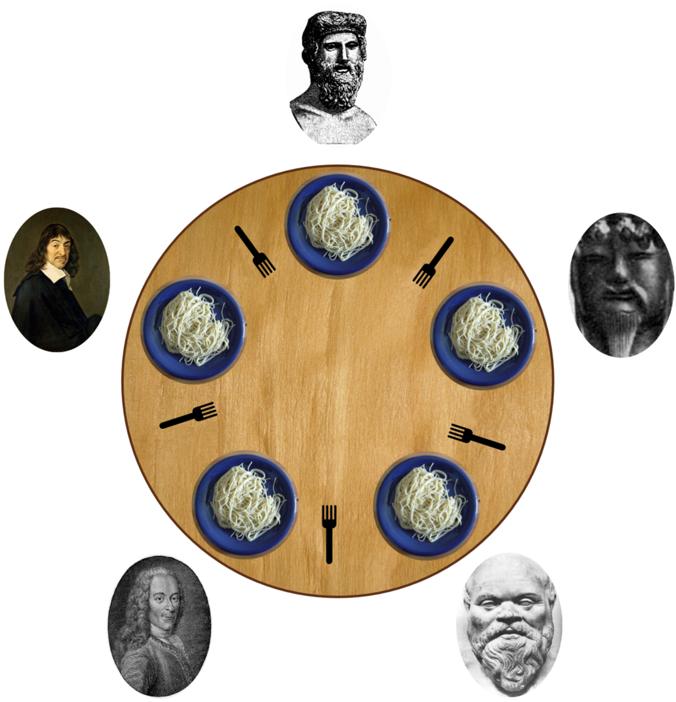

# Philosophers



## Definition
The Philosophers project (42 school) is a coding exercise where students implement a solution to the Dining Philosophers Problem in C, using threads, processes, mutexes, or semaphores to manage shared resources and prevent deadlock or starvation in a concurrent simulation of philosophers eating and thinking.

```
• This project is to be coded in C, following the 42 Norm. Any leak, crash, undefined
behavior or norm error means 0 to the project.

• A number of philosophers are sitting at a round table doing one of three things:
eating, thinking or sleeping.

• While eating, they are not thinking or sleeping, while sleeping, they are not eating
or thinking and of course, while thinking, they are not eating or sleeping.

• The philosophers sit at a circular table with a large bowl of spaghetti in the center.
• There are some forks on the table.

• As spaghetti is difficult to serve and eat with a single fork, it is assumed that a
philosopher must eat with two forks, one for each hand.

• The philosophers must never be starving.

• Every philosopher needs to eat.

• Philosophers don’t speak with each other.

• Philosophers don’t know when another philosopher is about to die. 

• Each time a philosopher has finished eating, he will drop his forks and start sleeping.

• When a philosopher is done sleeping, he will start thinking.

• The simulation stops when a philosopher dies.

• Each program should have the same options: number_of_philosophers time_to_die
time_to_eat time_to_sleep [number_of_times_each_philosopher_must_eat]

◦ number_of_philosophers: is the number of philosophers and also the number
of forks

◦ time_to_die: is in milliseconds, if a philosopher doesn’t start eating ’time_to_die’
milliseconds after starting his last meal or the beginning of the simulation, it
dies

◦ time_to_eat: is in milliseconds and is the time it takes for a philosopher to
eat. During that time he will need to keep the two forks.

◦ time_to_sleep: is in milliseconds and is the time the philosopher will spend
sleeping.

◦ number_of_times_each_philosopher_must_eat: argument is optional, if all
philosophers eat at least ’number_of_times_each_philosopher_must_eat’ the
simulation will stop. If not specified, the simulation will stop only at the death
of a philosopher.

• Each philosopher should be given a number from 1 to ’number_of_philosophers’.

• Philosopher number 1 is next to philosopher number ’number_of_philosophers’.
Any other philosopher with number N is seated between philosopher N - 1 and
philosopher N + 1

• Any change of status of a philosopher must be written as follows (with X replaced
with the philosopher number and timestamp_in_ms the current timestamp in milliseconds)
◦ timestamp_in_ms X has taken a fork  
◦ timestamp_in_ms X is sleeping  
◦ timestamp_in_ms X is thinking  
◦ timestamp_in_ms X died  

• The status printed should not be scrambled or intertwined with another philosopher’s status.

• You can’t have more than 10 ms between the death of a philosopher and when it
will print its death.

• Again, philosophers should avoid to die!
```

## keys concepts
- each process can have multiple threads of execution.
- Each thread is executing the same program code and shares the same data area and heap.
- each thread has it own stack containing local variables and function call linkage information.
- Threads can communicate with each other via the global variables that they share.

## Race condition
A race condition happens when two or more processes or threads access shared data at the same time, and the final outcome depends on the timing of their execution. If not handled properly, it can lead to unexpected or incorrect behavior.
#### Example:
Two threads try to increase a counter:
- Thread ```A``` reads value ```5```
- Thread ```B``` reads value ```5```
- Both add ```1``` → get ```6```
- Both write ```6``` → final value is ```6```, but it should be ```7```
To prevent this, we use synchronization techniques like ```mutexes``` or ```semaphores```.

## handling Deadlock
### ``` Deadlock definition```
A deadlock in multithreading occurs when two or more threads are unable to proceed because each is waiting for a resource (e.g., a lock) that another thread holds, creating a circular dependency. No thread can progress, causing the program to hang.
Example:
- Thread 1 holds Lock A and waits for Lock B.
- Thread 2 holds Lock B and waits for Lock A. Both threads wait indefinitely, resulting in a deadlock.


## New concepts, functions
### Mutex
A `mutex` (mutual exclusion lock) ensures that only one thread at a time can access a shared resource (e.g., critical section).
In POSIX threads (pthreads), a mutex is represented by:
```C
pthread_mutex_t lock;
```
### pthraed_mutex_init
```C
int pthread_mutex_init(pthread_mutex_t *mutex,
                       const pthread_mutexattr_t *attr);
```
**What it does:**

1. Initializes the mutex struct:
- Sets lock state to unlocked.
- Sets owner = none.
- Initializes recursion count, waiters list, and other metadata.
2. Applies attributes:
- If attr == NULL: uses defaults.
- If not NULL: applies custom settings (recursive, robust, priority inheritance, etc.).
3. No kernel call normally:
- It just writes into the pthread_mutex_t struct in user space.
- Syscalls (via futex) only happen later when contention occurs.
**Default behavior (NULL attributes):**
- Type: PTHREAD_MUTEX_DEFAULT (normal, non-recursive).
- Protocol: PTHREAD_PRIO_NONE (no priority inheritance).
- Robustness: normal (not robust).
- Sharing: process-private.
**Internal struct (simplified from glibc):**
```C
typedef union {
    struct {
        int __lock;          // lock state (0 = unlocked, 1 = locked, etc.)
        unsigned int __count; // recursion count
        int __owner;         // thread ID of owner
        unsigned int __nusers; // number of waiters
        int __kind;          // mutex type
        short __spins;       // adaptive spinning
        short __elision;     // transactional memory (if supported)
        __pthread_list_t __list; // robust/PI waiters
    } __data;
} pthread_mutex_t;
```
### 🔒 pthread_mutex_lock
```C
int pthread_mutex_lock(pthread_mutex_t *mutex);
```
**What it does:**
1. Fast path (no contention):
- Atomically sets __lock from 0 → 1.
- If successful → thread owns the lock.
2. If already locked (contention):
- If recursive and owned by the same thread → increment __count.
- If error-checking mutex and owned by the same thread → return EDEADLK.
Otherwise → block using the futex syscall until lock is available.
3. Owner bookkeeping:
- Sets __owner to current thread ID.
- Updates robust mutex list if needed.

### 🔓 pthread_mutex_unlock
```C
int pthread_mutex_unlock(pthread_mutex_t *mutex);
```
1. What it does:
- Ownership check:
- Normal mutex: unlocking by non-owner = undefined behavior.
- Error-checking mutex: returns EPERM if non-owner tries.
2. Recursive mutex case:
- If __count > 0, just decrements recursion counter, keeps lock held.
- Fast path (no waiters):
- Atomically sets __lock = 0.
- Clears __owner and __count.
3. If waiters exist:
- Calls futex wake to notify waiting threads.

**⚡ Performance Note**
- Both lock and unlock are implemented to run in user space first with atomic operations.
- The kernel (futex) is only involved when:
    - A thread must block (mutex already held).
    - A thread must be woken up (unlock with waiters).

This design avoids unnecessary syscalls and makes uncontended locks very fast.

**📌 Mutex Attributes (pthread_mutexattr_t)**
Examples of what you can set if you don’t pass NULL:
- Type:
    - `PTHREAD_MUTEX_NORMAL`
    - `PTHREAD_MUTEX_RECURSIVE`
    - `PTHREAD_MUTEX_ERRORCHECK`
    - Robustness:
    - `PTHREAD_MUTEX_STALLED` (default)
    - `PTHREAD_MUTEX_ROBUST`
- Protocol:
    - `PTHREAD_PRIO_NONE` (default)
    - `PTHREAD_PRIO_INHERIT`
    - `PTHREAD_PRIO_PROTECT`
- Sharing:
    - `PTHREAD_PROCESS_PRIVATE` (default)
    - `PTHREAD_PROCESS_SHARED`
example
```C
pthread_mutexattr_t attr;
pthread_mutexattr_init(&attr);
pthread_mutexattr_settype(&attr, PTHREAD_MUTEX_RECURSIVE);

pthread_mutex_t lock;
pthread_mutex_init(&lock, &attr);
```

**🧩 Analogy**

`pthread_mutex_lock`:
“Grab the key. If it’s free, take it. If someone else has it, wait in line (kernel futex).”
`pthread_mutex_unlock`:
“Put the key back. If people are waiting, wake one of them so they can take it.”

### Futex
Futex stands for Fast Userspace muTEX.
It’s a Linux kernel mechanism used to implement efficient synchronization primitives (mutexes, condition variables, semaphores, etc.) in user space.

** why Futex? **

Before futexes, every pthread_mutex_lock or unlock could involve a system call into the kernel — even when there was no contention. This was expensive.
Futexes fix that by allowing:
- Uncontended locks → handled entirely in user space (fast, no kernel overhead).
- Contended locks → only then, threads go into the kernel to sleep/wake.
So most locks/unlocks are just a few atomic instructions in user space.
The kernel is only used as a fallback.

** How it works **

A futex is basically a 32-bit integer in user space that multiple threads can read/write atomically.
There are two main operations via the futex syscall:
1. Wait (block):
- futex(&addr, FUTEX_WAIT, expected_value, ...)
- Thread sleeps if the value at addr still equals expected_value.
2. Wake (unblock):
- futex(&addr, FUTEX_WAKE, n, ...)
- Wake up up to n threads waiting on that futex word.

** 🔒 Example: Mutex with futex **

Imagine mutex->__lock is a futex word (integer):
- Thread A (lock):
    - Atomically change 0 → 1.
    - Success? Lock acquired (user space only).
    - Fail? Call futex(FUTEX_WAIT) to sleep until it becomes 0.
- Thread B (unlock):
    - Atomically set __lock = 0.
    - If waiters exist, call futex(FUTEX_WAKE) to wake one.

    - This is exactly how pthread_mutex_lock/unlock works under the hood in Linux.

